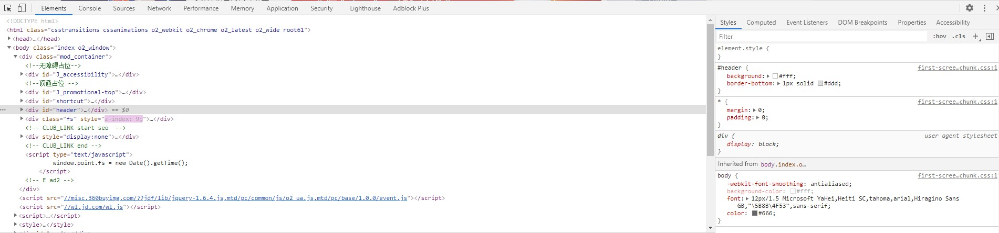
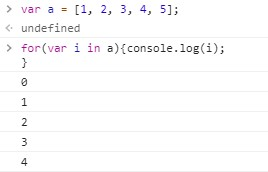

# Google等浏览器开发者工具的使用  
## Google Chrome  
### 开发者工具  
+ 打开方式  
    - 方式一： 空白处右键-><kbd>检查</kbd>
    - 方式二： <kbd>F12</kbd>  
      
+ Elements  
    - 网页源代码  
+ Styles   
    - 网页的样式，可以修改查看效果  
+ Console（控制台）  
    - 可以编写JavaScript代码  
    

---
# vscode，hbuilderX，sublime等编辑器的使用  
## vscode
+ [vscode下载地址](https://code.visualstudio.com/download)
## hbuilderX
+ [hbuilderX下载地址](https://www.dcloud.io/hbuilderx.html)
## sublime
+ [sublime下载地址](https://www.sublimetext.com/3)

---
# JavaScript编程语言，esc6版的实践  
+ [w3school](https://www.w3school.com.cn/index.html)
+ [es6](https://es6.ruanyifeng.com/) 
    - Babel 转码器  
        - Babel 是一个广泛使用的 ES6 转码器，可以将 ES6 代码转为 ES5 代码，从而在老版本的浏览器执行。
        ```javascript
        <script src="https://unpkg.com/@babel/standalone/babel.min.js"></script>
        <script type="text/babel">
        // Your ES6 code
        </script>
        ```
    - let, const: let声明后的变量用于当前代码块，const声明的变量为常量，只读
    - 变量的解构赋值  
    ```javascript
    let [a, b, c] = [1, 2, 3];
    let [foo, [[bar], baz]] = [1, [[2], 3]];
    foo // 1
    bar // 2
    baz // 3
    ```
    - 函数的扩展
    ```javascript
    //形参默认值 ##########
    //es5写法
    function log(x, y) {
    y = y || 'World';
    console.log(x, y);
    }

    log('Hello') // Hello World
    log('Hello', 'China') // Hello China
    log('Hello', '') // Hello World    

    //es6写法
    function log(x, y = 'World') {
        console.log(x, y);
    }

    log('Hello') // Hello World
    log('Hello', 'China') // Hello China
    log('Hello', '') // Hello

    //箭头函数 => ##########
    var f = () => 5;
    // 等同于
    var f = function () { return 5 };

    var sum = (num1, num2) => num1 + num2;
    // 等同于
    var sum = function(num1, num2) {
    return num1 + num2;
    };
    ```
    - class的基本语法
    ```javascript
    class Point {
        constructor(x, y) {
            this.x = x;
            this.y = y;
        }

        toString() {
            return '(' + this.x + ', ' + this.y + ')';
        }
    }
    ```
    - class的继承
    ```javascript
    class ColorPoint extends Point {
    }

    // 等同于
    class ColorPoint extends Point {
        constructor(...args) {
            super(...args);
        }
    }

    //注意
    class Point {
        constructor(x, y) {
            this.x = x;
            this.y = y;
        }
    }

        class ColorPoint extends Point {
        constructor(x, y, color) {
            this.color = color; // ReferenceError
            super(x, y);
            this.color = color; // 正确
        }
    }
    ```

---
# bootstrap
+ 官网链接
    - [v3](https://www.bootcss.com/)
    - [v4](https://v4.bootcss.com/)
+ 基本模板
    ```html
    <!doctype html>
    <html lang="en">
        <head>
            <!-- Required meta tags -->
            <meta charset="utf-8">
            <meta name="viewport" content="width=device-width, initial-scale=1, shrink-to-fit=no">

            <!-- Bootstrap CSS -->
            <link rel="stylesheet" href="https://cdn.jsdelivr.net/npm/bootstrap@4.5.0/dist/css/bootstrap.min.css" integrity="sha384-9aIt2nRpC12Uk9gS9baDl411NQApFmC26EwAOH8WgZl5MYYxFfc+NcPb1dKGj7Sk" crossorigin="anonymous">

            <title>Hello, world!</title>
        </head>
        <body>
            <h1>Hello, world!</h1>

            <!-- Optional JavaScript -->
            <!-- jQuery first, then Popper.js, then Bootstrap JS -->
            <script src="https://cdn.jsdelivr.net/npm/jquery@3.5.1/dist/jquery.slim.min.js" integrity="sha384-DfXdz2htPH0lsSSs5nCTpuj/zy4C+OGpamoFVy38MVBnE+IbbVYUew+OrCXaRkfj" crossorigin="anonymous"></script>
            <script src="https://cdn.jsdelivr.net/npm/popper.js@1.16.0/dist/umd/popper.min.js" integrity="sha384-Q6E9RHvbIyZFJoft+2mJbHaEWldlvI9IOYy5n3zV9zzTtmI3UksdQRVvoxMfooAo" crossorigin="anonymous"></script>
            <script src="https://cdn.jsdelivr.net/npm/bootstrap@4.5.0/dist/js/bootstrap.min.js" integrity="sha384-OgVRvuATP1z7JjHLkuOU7Xw704+h835Lr+6QL9UvYjZE3Ipu6Tp75j7Bh/kR0JKI" crossorigin="anonymous"></script>
        </body>
    </html>
    ```
+ 栅格系统
+ 组件


