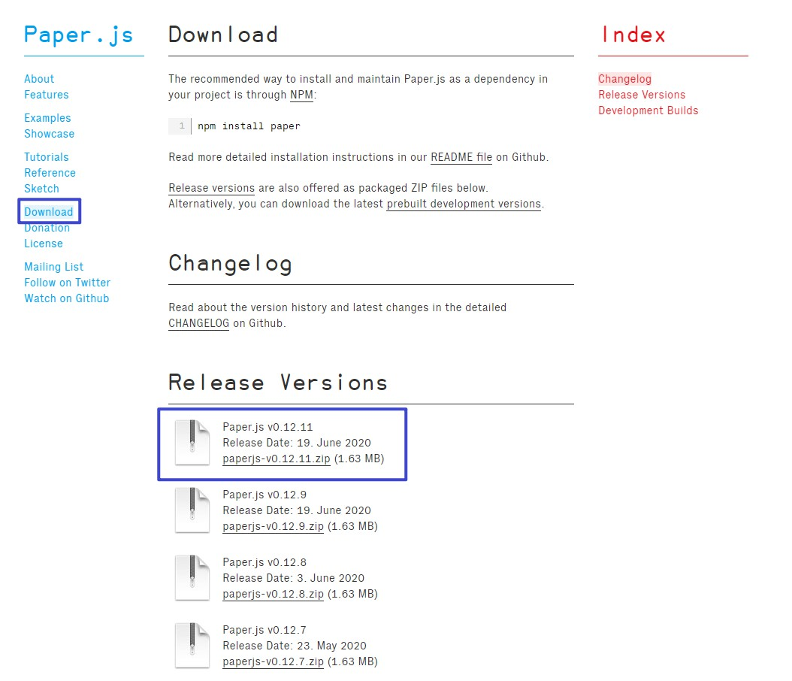

# 可视化及交互编程基础 
## 两种绘图方式

### Canvas 基于像素
参考网站：
https://developer.mozilla.org/zh-CN/docs/Web/API/Canvas_API
https://www.runoob.com/html/html5-canvas.html
+ \<canvas\>元素
```html
<canvas id="tutorial" width="150" height="150"></canvas> // 只有width和height两个属性
```
+ 模板骨架
```html
<html>
  <head>
    <title>Canvas tutorial</title>
    <script type="text/javascript">
      function draw(){
        var canvas = document.getElementById('tutorial');
	    // 渲染2d上下文
        if (canvas.getContext){
          var ctx = canvas.getContext('2d');
		  // 画图代码
        }
      }
    </script>
    <style type="text/css">
      canvas { border: 1px solid black; }
    </style>
  </head>
  <body onload="draw();">
    <canvas id="tutorial" width="150" height="150"></canvas>
  </body>
</html>
```
+ 基本函数
	- 绘制矩形
	```js
	fillRect(x, y, width, height) // 绘制一个填充的矩形
	strokeRect(x, y, width, height) // 绘制一个矩形的边框
	clearRect(x, y, width, height) // 清除指定矩形区域，让清除部分完全透明。
	```
	- 绘制路径
	```js
	beginPath() // 新建一条路径，生成之后，图形绘制命令被指向到路径上生成路径。
	closePath() // 闭合路径之后图形绘制命令又重新指向到上下文中。
	stroke() // 通过线条来绘制图形轮廓。
	fill() // 通过填充路径的内容区域生成实心的图形。
	```
	- 圆弧
	```js
	arc(x, y, radius, startAngle, endAngle, anticlockwise) // 画一个以（x,y）为圆心的以radius为半径的圆弧（圆），从startAngle开始到endAngle结束，按照anticlockwise给定的方向（默认为顺时针）来生成。
	arcTo(x1, y1, x2, y2, radius) // 根据给定的控制点和半径画一段圆弧，再以直线连接两个控制点。
	```
* 点
```js
ctx.fillRect(50, 50, 1, 1);
```
* 线
```js
ctx.beginPath();
ctx.moveTo(25, 25);
ctx.lineTo(100, 100);
ctx.closePath();
ctx.stroke();
```
* 面
```js
ctx.fillRect(50, 50, 55, 55);
// or
ctx.beginPath();
ctx.moveTo(25, 25);
ctx.lineTo(100, 25);
ctx.lineTo(100, 100);
ctx.lineTo(25, 100);
ctx.closePath();
ctx.fill();
```

### SVG 可伸缩矢量图形

https://www.runoob.com/svg/svg-tutorial.html

+ 几何元素及属性  
  + 矩形 <rect>
    + x, y, width, height
	```html
	<svg>
	    <rect width="300" height="100" style="fill:rgb(0,0,255);stroke-width:1;stroke:rgb(0,0,0)"/>
	</svg>
	// or 
	<svg>
	    <rect width="300" height="100" fill="rgb(0,0,255)" stroke-width="1px" stroke="rgb(0,0,0)"/>
	</svg>
	```
  + 圆形 <circle>
     + cx, cy, r
	 ```html
	 <svg>
	    <circle cx="100" cy="50" r="40" stroke="black" stroke-width="2" fill="red" />
	 </svg>
	 ```
  + 椭圆 <ellipse>
     + cx, cy, rx, ry
	 ```html
	 <svg>
	     <ellipse cx="300" cy="80" rx="100" ry="50" style="fill:yellow;stroke:purple;stroke-width:2"/>
	 </svg>
	 ```
  + 线 <line>
     + x1, y1, x2, y2
	 ```html
	 <svg>
	     <line x1="0" y1="0" x2="200" y2="200" style="stroke:rgb(255,0,0);stroke-width:2"/>
	 </svg>
	 ```
  + 折线 <polyline>
     + points
	 ```html
	 <svg>
	     <polyline points="20,20 40,25 60,40 80,120 120,140 200,180" style="fill:none;stroke:black;stroke-width:3" />
	 </svg>
	 ```
  + 多边形 <polygon>
     + points
	 ```html
	 <svg  height="210" width="500">
	     <polygon points="200,10 250,190 160,210" style="fill:lime;stroke:purple;stroke-width:1"/>
	 </svg>
	 ```
  + 路径 <path>
     + d    
		- M = moveto  
		- L = lineto  
		- H = horizontal lineto  
		- V = vertical lineto  
		- C = curveto  
		- S = smooth curveto  
		- Q = quadratic Bézier curve  
		- T = smooth quadratic Bézier curveto  
		- A = elliptical Arc  
		- Z = closepath  
	**以上所有命令均允许小写字母。大写表示绝对定位，小写表示相对定位。**
		 ```
  + 文本 <text>
  
     + 初级文本 
	```html
        <svg xmlns="http://www.w3.org/2000/svg" version="1.1">
		<text x="0" y="15" fill="red">I love SVG</text>
	</svg>
	```
	
     + 旋转字体
     	```html
        <svg xmlns="http://www.w3.org/2000/svg" version="1.1">
		<text x="0" y="15" fill="red" transform="rotate(30 20,40)">I love SVG</text>
	</svg>
	```
	
     + 作为连接的字体
     ```html
	<svg xmlns="http://www.w3.org/2000/svg" version="1.1" xmlns:xlink="http://www.w3.org/1999/xlink">
		<a xlink:href="http://www.w3schools.com/svg/" target="_blank"> 
			<text x="0" y="15" fill="red">I love SVG</text>
		</a>
	</svg>
	```

## 交互
  * 绑定交互事件
       
  * 鼠标交互事件

https://blog.csdn.net/qq_18407565/article/details/70249644
  
   + onclick
   + onmouseout
   + onmouseover
   + onmouseleave
    

### SVG库paper.js

http://paperjs.org/
+ 下载js包  
	
+ 加载paper.js库
	```html
	<script type="text/javascript" src="js/paper.js"></script>
	```
+ 定义内联 PaperScript，将其与 myCanvas 相关联
	```html
	<script type="text/paperscript" canvas="myCanvas"><!-- canvas填canvas的id -->
	    // code
		.......
	</script>
	```
	例子：  
	```html
	<!DOCTYPE html>
	<html>
	<head>
	<!-- 加载 Paper.js 库 -->
	<script type="text/javascript" src="js/paper.js"></script>
	<!-- 定义内联 PaperScript，将其与 myCanvas 相关联 -->
	<script type="text/paperscript" canvas="myCanvas">
	    // 创建 Paper.js 路径，在其中绘制线条：
	    var path = new Path();
	    // 给笔画一种颜色
	    path.strokeColor = 'black';
	    var start = new Point(100, 100);
	    // 移动到开始位并从那开始画一条线
	    path.moveTo(start);
	    // 注意 Point 对象上的加号运算符。
	    // PaperScript 为我们做了这些，还有更多！
	    path.lineTo(start + [ 100, -50 ]);
	</script>
	</head>
	<body>
	    <canvas id="myCanvas" resize></canvas>
	</body>
	</html>
	```
	canvas配置
	```js
	var path = new Path.Circle({
		center: view.center,
		radius: 30,
		strokeColor: 'black'
	});
	
	function onResize(event) {
		// Whenever the window is resized, recenter the path:
		path.position = view.center;
	}
	```
	```css
	html,
	body {
	    height: 100%;
	}
	canvas[resize] {
	    width: 100%;
	    height: 100%;
	}
	```
---
+ 直接使用JavaScript
	```html
	<!-- 定义内联 JavaScript -->
	<script type="text/javascript">
	    // 当 DOM 渲染完毕时执行代码
	    window.onload = function() {
	        // 获取 canvas 对象的引用
	        var canvas = document.getElementById('myCanvas');
	        // 为 canvas 创建一个空项目和视图:
	        paper.setup(canvas);
	        // 创建一个 Paper.js 路径 在其中绘制线条:
	        var path = new paper.Path();
	        // 给画笔上色
	        path.strokeColor = 'black';
	        var start = new paper.Point(100, 100);
	        // 移动到起始点并从那开始画线
	        path.moveTo(start);
	        // 注意 Point 对象上的加法运算在 JavaScript 中不再有效
	        // 我们需要调用 add() 函数:
	        path.lineTo(start.add([ 200, -50 ]));
	        // 绘制视图:
	        paper.view.draw();
	    }
	</script>
	```
+ 作用域全局化
	- 方法一
	```js
	// 通过把 paper 注入到 window，使 paper 作用域全局化:
	paper.install(window);
	window.onload = function() {
	    // 直接从 canvas 的 id 设置:
	    paper.setup('myCanvas');
	    var path = new Path();
	    path.strokeColor = 'black';
	    var start = new Point(100, 100);
	    path.moveTo(start);
	    path.lineTo(start.add([ 200, -50 ]));
	    view.draw();
	}
	```
	- 方法二
	```js
	window.onload = function() {
	    paper.setup('myCanvas');
	    with (paper) {
	        var path = new Path();
	        path.strokeColor = 'black';
	        var start = new Point(100, 100);
	        path.moveTo(start);
	        path.lineTo(start.add([ 200, -50 ]));
	        view.draw();
	    }
	}
	```
+ 设置时间处理程序
	- onFrame
	```js
	<script type="text/javascript">
	    paper.install(window);
	    window.onload = function() {
	        paper.setup('myCanvas');
	        var path = new Path.Rectangle([75, 75], [100, 100]);
	        path.strokeColor = 'black';
	
	        view.onFrame = function(event) {
	            // 每一帧时，路径旋转3度:
	            path.rotate(3);
	        }
	    }
	</script>
	```
	- onResize
+ 使用工具
	- onMouseDown，onMouseUp，onMouseDrag，onMouseMove
	```html
	<script type="text/javascript">
	    paper.install(window);
	    window.onload = function() {
	        paper.setup('myCanvas');
	        // 创建一个简单的绘画工具:
	        var tool = new Tool();
	        var path;
	
	        // 定义一个 mousedown 和 mousedrag 处理程序
	        tool.onMouseDown = function(event) {
	            path = new Path();
	            path.strokeColor = 'black';
	            path.add(event.point);
	        }
	
	        tool.onMouseDrag = function(event) {
	            path.add(event.point);
	        }
	    }
	</script>
	```
	- 多工具
	```html
	<script type="text/javascript">
	    paper.install(window);
	    // 保持两个 tool 的全局引用，
	    // 以此让下面的 html 链接可以直接访问。
	    var tool1, tool2;
	
	    window.onload = function() {
	        paper.setup('myCanvas');
	
	        // 创建两个绘画工具
	        // tool1 画直线
	        // tool2 画云
	
	        // 共享同一个mouseDown 事件:
	        var path;
	        function onMouseDown(event) {
	            path = new Path();
	            path.strokeColor = 'black';
	            path.add(event.point);
	        }
	
	        tool1 = new Tool();
	        tool1.onMouseDown = onMouseDown;
	
	        tool1.onMouseDrag = function(event) {
	            path.add(event.point);
	        }
	
	        tool2 = new Tool();
	        tool2.minDistance = 20;
	        tool2.onMouseDown = onMouseDown;
	
	        tool2.onMouseDrag = function(event) {
	            // 使用 arcTo 命令画云的线
	            path.arcTo(event.point);
	        }
	    }
	</script>

	<body>
	    <a href="#" onclick="tool1.activate();">Lines</a>
	    <a href="#" onclick="tool2.activate();">Clouds</a>
	    <canvas id="myCanvas" resize></canvas>
	</body>
	```
---
+ 点Point
	```js
	var myPoint = new Point();
	console.log(myPoint); // { x: 0, y: 0 }
	
	// 现在我们改变 x 坐标值为 10...
	myPoint.x = 10;
	
	// ...y 坐标值为 x + 10
	myPoint.y = myPoint.x + 10;
	console.log(myPoint); // { x: 10, y: 20 }
	```
+ 尺寸Size
	```js
	var mySize = new Size();
	console.log(mySize); // { width: 0, height: 0 }
	
	mySize.width = 10;
	mySize.height = mySize.width + 10;
	console.log(mySize); // { width: 10, height: 20 }
	```
+ 矩形Rectangle
	```js
	var topLeft = new Point(10, 20);
	var rectSize = new Size(200, 100);
	var rect = new Rectangle(topLeft, rectSize);
	console.log(rect); // { x: 10, y: 20, width: 200, height: 100 }
	console.log(rect.point); // { x: 10, y: 20 }
	console.log(rect.size); // { width: 200, height: 100 }
	// or 
	var rect = new Rectangle(10, 20, 200, 100);
	console.log(rect); // { x: 10, y: 20, width: 200, height: 100 }
	// or 
	var bottomLeft = new Point(10, 120);
	var topRight = new Point(210, 20);
	var rect = new Rectangle(bottomLeft, topRight);
	console.log(rect); // { x: 10, y: 20, width: 200, height: 100 }
	// or 
	var rect = new Rectangle();
	rect.left = 100;
	rect.right = 200;
	rect.bottom = 400;
	rect.top = 200;
	console.log(rect); // { x: 100, y: 200, width: 100, height: 200 }
	```
+ 路径Path
	- add
	```js
	var myPath = new Path();
	myPath.strokeColor = 'black';
	myPath.add(new Point(0, 0));
	myPath.add(new Point(100, 50));
	```
	- insert
	```js
	var myPath = new Path();
	myPath.strokeColor = 'black';
	myPath.add(new Point(0, 0), new Point(100, 50));
	
	// 在路径中两个已存在的段之间插入一个新段
	myPath.insert(1, new Point(30, 40));
	```
	- 平滑路径
	```js
	var path = new Path();
	path.strokeColor = 'black';
	path.add(new Point(30, 75)); 
	path.add(new Point(30, 25)); 
	path.add(new Point(80, 25));
	path.add(new Point(80, 75));
	path.closed = true;
	
	// 选中路径，从而观察它的柄
	path.fullySelected = true;
	
	// 创建一份路径的拷贝，并向右移动100像素
	var copy = path.clone();
	copy.fullySelected = true;
	copy.position.x += 100;
	
	// 平滑路径的
	copy.smooth();
	```
	- 闭合路径
	```js
	myPath.closed = true; // 默认打开
	```
	- 删除路径
	```js
	var myCircle = new Path.Circle(new Point(100, 70), 50);
	myCircle.strokeColor = 'black';
	myCircle.selected = true;
	
	myCircle.removeSegment(0);
	```
+ 创建预定义的形状
	- 圆形路径
	```js
	var myCircle = new Path.Circle(new Point(100, 70), 50);
	myCircle.fillColor = 'black';
	```
	- 矩形路径
	```js
	var rectangle = new Rectangle(new Point(50, 50), new Point(150, 100));
	var path = new Path.Rectangle(rectangle);
	path.fillColor = '#e9e9ff';
	path.selected = true;
	```
	- 圆角矩形路径
	```js
	var rectangle = new Rectangle(new Point(50, 50), new Point(150, 100));
	var cornerSize = new Size(20, 20);
	var path = new Path.RoundRectangle(rectangle, cornerSize);
	path.fillColor = 'black';
	```
	- 正多边形路径
	```js
	// 创建三角形路径
	var triangle = new Path.RegularPolygon(new Point(80, 70), 3, 50);
	triangle.fillColor = '#e9e9ff';
	triangle.selected = true;
	
	// 创建十边形路径
	var decagon = new Path.RegularPolygon(new Point(200, 70), 10, 50);
	decagon.fillColor = '#e9e9ff';
	decagon.selected = true;
	```
+ 创建鼠标事件
	```js
	function onMouseDown(event) {
	    console.log('You pressed the mouse!');
	}
	
	function onMouseDrag(event) {
	    console.log('You dragged the mouse!');
	}
	
	function onMouseUp(event) {
	    console.log('You released the mouse!');
	}
	```
