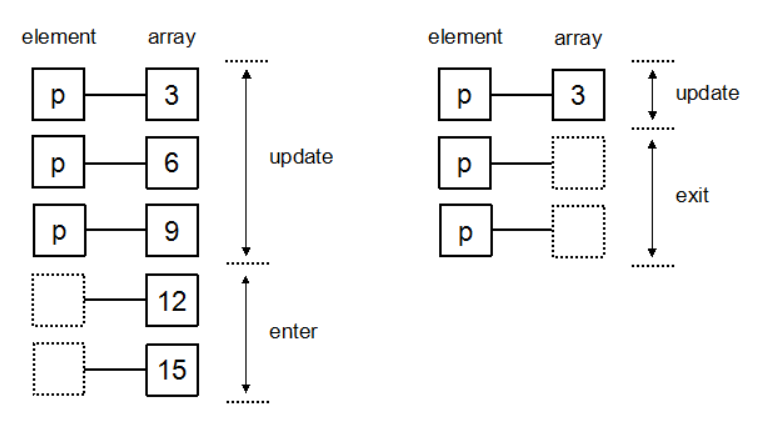

### D3简介

D3（全称：Data-Driven Documents），一个被数据驱动的文档

- 一个JavaScript库，主要作用做数据可视化，

- 制作各种炫酷的图表，各种折线图、力导向图等，

**D3与echarts区别：**

|                   D3                    |        Echarts         |
| :-------------------------------------: | :--------------------: |
|            底层，学习成本大             |    封装好，容易上手    |
|            通过svg来绘制图形            |  通过canvas来绘制图形  |
|             可以自定义事件              |    直接用，不能修改    |
| svg支持事件处理器（鼠标、键盘、触屏等） | canvas不支持事件处理器 |


**学习 D3 需要什么预备知识**

- HTML：超文本标记语言，用于设定网页的内容
- CSS：层叠样式表，用于设定网页的样式
- JavaScript：一种直译式脚本语言，用于设定网页的行为
- DOM：文档对象模型，用于修改文档的内容和结构
- SVG：可缩放矢量图形，用于绘制可视化的图形


### **D3下载与加载**

下载D3：[D3官网：https://d3js.org/](https://d3js.org/)

加载D3：

要直接链接到最新版本，可复制以下代码：

```
<script src="https://d3js.org/d3.v6.min.js"></script>
```

加载本地d3.js文件，将两个下载好的js文件复制到与test.html同一个文件目录

```
<script type="text/javascript" src="d3.min.js" ></script>
<script type="text/javascript" src="d3.js"></script>
```


### D3的第一个程序

在HTML 中输出 Hello World

```
<body> 
    <p>Hello World 1</p>
    <p>Hello World 2</p>
</body> 
```

使用JS去修改标签p段落里的内容

```
<script type="text/javascript">
	var paragraphs = document.getElementsByTagName("p");
	for(i = 0;i < paragraphs.length;i++)
		paragraphs[i].innerHTML = "I like dogs";	
</script>
```

使用D3修改标签p段落里的内容

```
d3.select("body").selectAll("p").text("I like dogs");
```

选择body中所有的p，其文本内容为 I like dogs，将选择集保存在变量 p 中

```
var p = d3.select("body").selectAll("p").text("I like dogs");
```

现在对p进行样式设置，如改变文字颜色、大小等

```
p.style("color","blue")
 .style("font-size","36px");
```

- **选择集:**使用 d3.select() 或 d3.selectAll() 选择元素后返回的对象，就是选择集。
- **链式语法:**d3.select().selectAll().text()


### D3选择元素和绑定数据

1. #### 选择集：

   在 D3 中，用于选择元素的函数有两个，这两个函数返回的结果称为选择集。

   - **d3.select()**：选择所有指定元素的第一个
   - **d3.selectAll()**：选择指定全部元素

   例如，选择集的常见用法如下。

   ```
   var body = d3.select("body"); //选择文档中的body元素
   var p1 = body.select("p");      //选择body中的第一个p元素
   var p = body.selectAll("p");    //选择body中的所有p元素
   var svg = body.select("svg");   //选择body中的svg元素
   var rects = svg.selectAll("rect");  //选择svg中所有的rect元素
   var id = body.select("#id"); //选择body中id元素
   var class = body.select(".class");//选择body中class类元素
   ```

   选择元素函数后常用链式表达接其他操作，如：

   ```
   <body>
   	<button id="id">123</button>
   </body>
   <script type="text/javascript">
   	d3.select("#id").text("I like dogs").style("color","red");
   </script>
   ```

2. #### 绑定数据：

   选择集和绑定数据通常是一起使用的，D3 中是通过以下两个函数来绑定数据的：

   - **datum()**：绑定一个**数据**到选择集上

   - **data()**：绑定一个**数组**到选择集上，数组的各项值分别与选择集的各元素绑定

   假设现在有三个段落元素如下：

   ```
   <body>
   	<p></p>
   	<p></p>
   	<p></p>
   </body>
   ```

   **如datum（）**

   有一数据类型为字符串“Hello World”，要将此字符串分别与三个段落元素绑定，代码如下：

   ```
   var str = "Hello World";
   
   var body = d3.select("body");
   var p = body.selectAll("p");
   
   //var p = d3.select("body").selectAll("p");
   
   p.datum(str);
   p.text(function(d, i){
       return "第 "+ i + " 个元素绑定的数据是 " + d;
   });
   ```

   前面代码也用到了一个无名函数 function(d, i)，其对应的情况如下：

   ```
   d ------- data    数据
   i ------- index   索引
   ```

   **如data()**

   有一个数组，里面元素分别为a,b,c，接下来要分别将数组的各元素绑定到三个段落元素上。

   ```
   var body = d3.select("body");
   var p= body.selectAll("p");
   
   var dataset = ["a","b","c"];
   
   p.data(dataset).text(function(d, i){
   		   return "This is " + d;
   		   });
   //当 i == 0 时， d 为 a。
   //当 i == 1 时， d 为 b。
   //当 i == 2 时， d 为 c。
   ```


### D3选择、插入、删除元素

1. #### 选择元素

   假设在body中有三个段落元素，分别是apple，banana，water

   ```
   <body>
   	<p>apple</p>
   	<p>banana</p>
   	<p>water</p>
   </body>
   ```

   选择第一个元素：

   若选择具有相同id名称、class名称、标签名称的一组元素中的第一个，d3.select()默认选择第一个

   ```
   d3.select("body").select("p").style("color","red");
   ```

   选择第二个元素：

   方法比较多，比较简单的是在第二个元素中添加id

   ```
   <p id="banana">banana</p>
   ------------------------
   d3.select("#banana").style("color","yellow");
   ```

   选择后两个元素：

   给后两个元素加上class类名

   ```
   <p class="Myclass">banana</p>
   <p class="Myclass">water</p>
   -----------------------------
   d3.selectAll(".Myclass").style("color","blue");
   ```

   选择所有元素：

   ```
   d3.select("body").selectAll("p").style("color","pink");
   ```

   

2. #### 插入元素

   插入元素涉及的函数有两个：

   - **append()：**在选择集末尾插入元素
   - **insert()：**在选择集前面插入元素

   *假设有三个段落元素，与上文相同。*

   

   此时body元素中已经有三个段落元素，在选择了body元素后调用了append()，即在已有的三个段落元素后面插入或新建一个段落元素，其内容为Hello World！

   ```
   var body = d3.select("body");
   body.append("p").text("Hello World!");
   ```

   此时body元素中已经有三个段落元素，在选择了body元素后调用了insert()，其中参数“#banana”指的是将新建的这个段落元素插入到id名称为“banana”的段落元素前

   ```
   d3.select("body").insert("p","#banana").text("Star");
   ```

   

3. #### 删除元素

   删除一个元素时，对于选择的元素，使用 remove 即可。

   - remove()

   ```
   d3.select("#Star").remove();
   ```


### 如何用D3在SVG画布中画图

*两种画布：svg与canvas（class2中已介绍）*

SVG 绘制的是矢量图，因此对图像进行放大不会失真，可以为每个元素添加 JavaScript 事件处理器。每个图形均视为对象，更改对象的属性，图形也会改变。要注意，在 SVG 中，x 轴的正方向是水平向右，y 轴的正方向是垂直向下的。

**添加画布**

D3 虽然没有明文规定一定要在 SVG 中绘图，但是 D3 提供了众多的 SVG 图形的生成器，它们都是只支持 SVG 的。因此，建议使用 SVG 画布。

使用 D3 在 body 元素中添加 svg 

```
var width = 300;  //画布的宽度
var height = 300;   //画布的高度

var svg = d3.select("body")     //选择文档中的body元素
    .append("svg")          //添加一个svg元素
    .attr("width", width)       //设定宽度
    .attr("height", height);    //设定高度
    .style("background-color","blue");//设定画布背景颜色
```

**绘制矩形**

绘制一个横向的柱形图。只绘制矩形，不绘制文字和坐标轴。在 SVG 中，矩形的元素标签是 rect。

矩形的属性通常有四个：

- x：矩形左上角的 x 坐标 
- y：矩形左上角的 y 坐标
- width：矩形的宽度 
- height：矩形的高度

如给定一组数据，将数组通过一个柱状图显示：

```

var dataset = [234,45,124,96,25,198];  //数据（表示矩形的宽度）
		
var width = 300;  //画布的宽度
var height = 300;   //画布的高度
		
var svg = d3.select("body")     //选择文档中的body元素
	   .append("svg")          //添加一个svg元素
	   .attr("width", width)       //设定宽度
	   .attr("height", height)    //设定高度
    .style("background-color","blue");//设定画布背景颜色
		    
var rectHeight = 25;   //每个矩形所占的像素高度(包括空白)

svg.selectAll("rect")//为每个矩形准备画笔
	.data(dataset)//绑定数据
	.enter()
	.append("rect")//根据数据开始绘画
	.attr("x",5)//设置每一个小矩形的左上角X坐标值
	.attr("y",function(d,i){
		return i * rectHeight;
	})//设置每一个小矩形的左上角y坐标值
	.attr("width",function(d){
		 return d;
	})//设置小矩形宽度
	.attr("height",rectHeight-2)//设置小矩形高度
	.attr("fill","steelblue");//填充小矩形
```

横向变纵向？

```
svg.selectAll("rect")
    .data(dataset)
    .enter()
    .append("rect")
    .attr("y",function(d,i){
         return height - d;
    })
    .attr("x",function(d,i){
         return i * rectHeight;
    })
    .attr("height",function(d){
         return d;
    })
    .attr("width",rectHeight-2)
    .attr("fill","steelblue");
```

**update()，enter()，exit()的说明**

Update、Enter、Exit 是 D3 中三个非常重要的概念，它处理的是当选择集和数据的数量关系不确定的情况。

- update()
  当对应的元素正好满足时 （ 绑定数据数量 = 对应元素 )，实际上并不存在这样一个函数，只是为了要与之后的 enter 和 exit 一起说明才想象有这样一个函数。但对应元素正好满足时，直接操作即可，后面直接跟 text ，style 等操作即可。
- enter()
  当对应的元素不足时 （ 绑定数据数量 > 对应元素 ），当对应的元素不足时，通常要添加元素，使之与绑定数据的数量相等。后面通常先跟 append 操作。
- exit()
  当对应的元素过多时 （ 绑定数据数量 < 对应元素 ），当对应的元素过多时，通常要删除元素，使之与绑定数据的数量相等。后面通常要跟 remove 操作。



### D3比例尺的使用

```
var dataset = [234,45,124,96,25,198];
```

前面画矩形的数组中，绘图时，直接使用234 给矩形的宽度赋值，即矩形的宽度就是234个像素。此方式非常具有局限性，如果数值过大或过小，例如：

```
var dataset_1 = [ 2.3 , 0.4 ,1.2 , 0.9 , 1.9 ];
var dataset_2 = [ 2500, 2100, 1700, 1300, 900 ];
```

对以上两个数组，绝不可能用 2.3个像素来代表矩形的宽度，那样根本看不见；也不可能用 2500 个像素来代表矩形的宽度，因为画布没有那么长。于是，我们需要一种计算关系，能够将某一区域的值映射到另一区域，其大小关系不变，这就是比例尺（Scale）。

D3 提供了多种比例尺，下面介绍最常用的两种。

- **线性比例尺**

  线性比例尺，能将一个连续的区间，映射到另一区间。要解决柱形图宽度的问题，就需要线性比例尺。假设有以下数组：

```
var dataset = [1.2, 2.3, 0.9, 1.5, 3.3];
```

现有要求如下：

将 dataset 中最小的值，映射成 0；将最大的值，映射成 300。代码如下：

```
var min = d3.min(dataset);
var max = d3.max(dataset);

var linear = d3.scaleLinear()
        .domain([min, max])
        .range([0, 300]);

linear(0.9);    //返回 0
linear(2.3);    //返回 175
linear(3.3);    //返回 300
```

其中，d3.scale.linear() 返回一个线性比例尺。domain() 和 range() 分别设定比例尺的定义域和值域。在这里还用到了两个函数，它们经常与比例尺一起出现：

```
d3.max()
d3.min()
```

这两个函数能够求数组的最大值和最小值，是 D3 提供的。按照以上代码，

比例尺的定义域 domain 为：[0.9, 3.3]

比例尺的值域 range 为：[0, 300]

因此，当输入 0.9 时，返回 0；当输入 3.3 时，返回 300。当输入 2.3 时呢？返回 175，这是按照线性函数的规则计算的。d3.scaleLinear() 是可以当做函数来使用的，才有这样的用法：linear(0.9)。

- 序数比例尺
  有时候，定义域和值域不一定是连续的。例如，有两个数组：

```
var index = [0, 1, 2, 3, 4];
var color = ["red", "blue", "green", "yellow", "black"];
```

我们希望 0 对应颜色 red，1 对应 blue，依次类推。

但是，这些值都是离散的，线性比例尺不适合，需要用到序数比例尺。

```
var ordinal = d3.scaleOrdinal()
        .domain(index)
        .range(color);

ordinal(0); //返回 red
ordinal(2); //返回 green
ordinal(4); //返回 black
```

用法与线性比例尺是类似的。

**给柱形图添加比例尺**

在前面基础上，修改一下数组，再定义一个线性比例尺。

```
var dataset = [2.34,0.45,1.24,0.96,0.25,1.98];  //数据（表示矩形的宽度）
//var dataset = [234,45,124,96,25,198];  //数据（表示矩形的宽度）

var width = 300;  //画布的宽度
var height = 300;   //画布的高度

var svg = d3.select("body")     //选择文档中的body元素
            .append("svg")          //添加一个svg元素
            .attr("width", width)       //设定宽度
            .attr("height", height)    //设定高度
            .style("background-color","blue");//设定画布背景颜色

var rectHeight = 25;   //每个矩形所占的像素高度(包括空白)

var linear=d3.scaleLinear()
                .domain([0,d3.max(dataset)])
                .range([0,234]);
svg.selectAll("rect")//为每个矩形准备画笔
        .data(dataset)//绑定数据
        .enter()
        .append("rect")//根据数据开始绘画
        .attr("x",5)//设置每一个小矩形的左上角X坐标值
        .attr("y",function(d,i){
        	return i * rectHeight;
})//设置每一个小矩形的左上角y坐标值
		.attr("width",function(d){
			return linear(d);
})//设置小矩形宽度
        .attr("height",rectHeight-2)//设置小矩形高度
        .attr("fill","steelblue");//填充小矩形
```

### D3绘制坐标轴

坐标轴在 SVG 中是没有现成的图形元素的，需要用其他的元素组合构成。

D3 提供了坐标轴的组件，如此在 SVG 画布中绘制坐标轴变得像添加一个普通元素一样简单。

**定义坐标轴**

前面提到了比例尺的概念，要生成坐标轴，需要用到比例尺，它们二者经常是一起使用的。

下面，在前面的数据和比例尺的基础上，添加一个坐标轴的组件。坐标轴是有朝向的，在这里我们以向下朝向、水平方向的坐标轴为例，其他朝向的（比如向左朝向的、垂直的坐标轴）类似

```
//为坐标轴定义一个线性比例尺
var xScale = d3.scaleLinear()
	.domain([0,d3.max(dataset)])
	.range([0,234]);
		
//定义一个坐标轴
var xAxis = d3.axisBottom(xScale)//定义一个axis，由bottom可知，是朝下的
	.ticks(7);//设置刻度数目
svg.append("g")
	.attr("transform","translate("+20+","+(dataset.length*rectHeight)+")")//定义坐标轴起点
	.call(xAxis);
```

**在 SVG 中添加坐标轴**

定义了坐标轴之后，只需要在 SVG 中添加一个分组元素 ，再将坐标轴的其他元素添加到组里即可。代码如下：

```
svg.append("g")
	.attr("transform","translate("+20+","+(dataset.length*rectHeight)+")")//定义坐标轴起点
	.call(xAxis);
```

### 准备

创建svg（400*400）

```
<!DOCTYPE html>
<html>
	<head>
		<script type="text/javascript" src="d3.min.js" ></script>
		<meta charset="utf-8">
		<title></title>
	</head>
	<body>
		
	</body>
<script type="text/javascript">
	//画布大小
	var width = 400;
	var height = 400;
	
	//在 body 里添加一个 SVG 画布   
	var svg = d3.select("body")
	    .append("svg")
	    .attr("width", width)
	    .attr("height", height);
	
	//画布周边的空白
	 var padding = {left:30, right:30, top:30, bottom:30};
	
	//定义一个数组
	var dataset = [10, 20, 30, 40, 33, 24, 12, 5];
		
	</script>
</html>

```

一个完整的柱形图包含三部分：矩形、文字、坐标轴。

### 添加坐标轴

```
	//x轴的比例尺
	var xScale = d3.scaleLinear()
	    .domain([0,dataset.length])
	    .range([0, width - padding.left - padding.right]);
	
	//y轴的比例尺
	var yScale = d3.scaleLinear()
	    .domain([0,d3.max(dataset)])
	    .range([height - padding.top - padding.bottom, 0]);

	//定义x轴在下方
	var xAxis = d3.axisBottom(xScale)
	//定义y轴在左边
	var yAxis = d3.axisLeft(yScale)
	
	//添加x轴
	svg.append("g")
	  .attr("class","axis")
	  .attr("transform","translate(" + padding.left + "," + (height - padding.bottom) + ")")
	  .call(xAxis); 
	
	//添加y轴
	svg.append("g")
	  .attr("class","axis")
	  .attr("transform","translate(" + padding.left + "," + padding.top + ")")
	  .call(yAxis);
```

### 添加矩形

```
	//矩形之间的空白
	var rectPadding = 5;
	
	//添加矩形元素
	var rect = svg.selectAll(".MyRect")
	        .data(dataset)
	        .enter()
	        .append("rect")
			.attr("fill","steelblue")
			//.transition()
			//.duration(2000)
			//.attr('fill', 'grey')
	        .attr("transform","translate(" + padding.left + "," + padding.top + ")")
	        .attr("x", function(d,i){
	            return xScale(i) + rectPadding/2 + (width-padding.left-padding.right)/(dataset.length*2);
	        } )
	        .attr("y",function(d){
	            return yScale(d);
	        })
	        .attr("width", (width-padding.left-padding.right)/dataset.length - rectPadding )
	        .attr("height", function(d){
	            return height - padding.top - padding.bottom - yScale(d);
	        })

```

### 添加文字标签

```
//添加文字元素
	var texts = svg.selectAll(".MyText")
	        .data(dataset)
	        .enter()
	        .append("text")
			.attr('font-size', '14px')
			.attr('fill', 'white')
	        .attr("transform","translate(" + padding.left + "," + padding.top + ")")
	        .attr("x", function(d,i){
	            return xScale(i) + rectPadding + (width-padding.left-padding.right)/(dataset.length+1)/2;
	        } )
	        .attr("y",function(d){
	            return yScale(d);
	        })
	        .attr("dx",function(){
	            return ((width-padding.left-padding.right)/(dataset.length+1)/2 - rectPadding)/2;
	        })
	        .attr("dy",function(d){
	            return "1em";
	        })
	        .text(function(d){
	            return d;
	        })			
```

可以修改文字标签颜色和位置。

### 添加一个圆型

在文字标签代码的基础上改

```
var circle = svg.selectAll("circle")
			.data(dataset)
			.enter()
			.append("circle")
			.attr('r', 6)
			.attr('fill', 'yellow')
			.attr("transform","translate(" + padding.left + "," + padding.top + ")")
			.attr("cx", function(d,i){
				return xScale(i) +  (width-padding.left-padding.right)/(dataset.length+1);
			} )
/*动画
			.attr("cy",function(){
				return height - padding.top - padding.bottom;
			})
			.transition()
			.delay(function(d,i){
				return i * 300;
			})
			.duration(2000)
			.ease(d3.easeBounce)
*/
			.attr("cy",function(d){
				return yScale(d) ;
			})
```

### 让图表动起来

**实现动态的方法**

1. transition() 启动过渡效果

   给矩形和文字标签加上颜色变换过渡，注意顺序问题。

```html
.attr("fill","steelblue")   //初始颜色
.transition()               //启动过渡
.attr("fill","grey")   		//终止颜色
```

2. duration() 指定过渡的持续时间，单位为毫秒。

3. ease()指定过渡的方式，常用的有：

​	linear：普通的线性变化
​	circle：慢慢地到达变换的最终状态
​	elastic：带有弹跳的到达最终状态
​	bounce：在最终状态处弹跳几次

```html
.ease(d3.easeCircle)
.ease(d3.easeElastic)
.ease(d3.easeBounce)
```

4. delay() 指定延迟的时间，表示一定时间后才开始转变,此函数可以对整体指定延迟，也可以对个别指定延迟。

对整体指定时：图形整体在延迟 1000 毫秒后发生变化，变化的时长为 3000 毫秒。因此，过渡的总时长为4000毫秒。

```html
.transition()
.duration(3000)
.delay(1000)
```

**实现简单的动态效果**

柱形图增长出现的效果，y和height都要调整

```
var rect = svg.selectAll(".MyRect")
	        .data(dataset)
	        .enter()
	        .append("rect")
			.attr("fill","steelblue")
			//.transition()
			//.duration(2000)
			//.attr('fill', 'grey')
			.attr("transform","translate(" + padding.left + "," + padding.top + ")")
	        .attr("x", function(d,i){
	            return xScale(i) + rectPadding/2 + (width-padding.left-padding.right)/(dataset.length+1)/2;
	        } )
	        .attr("width", (width-padding.left-padding.right)/(dataset.length+1) - rectPadding )
//动画       
			.attr("y", function(){
			    return height - padding.top - padding.bottom;
			})
			.attr("height", function(){
	            return 0;
	        })
			.transition()
			.delay(function(d,i){
			    return i * 300;
			})
			.duration(2000)
			//.ease(d3.easeBounce)
			.attr("y",function(d){
							return yScale(d);
						})
	        .attr("height", function(d){
	            return height - padding.top - padding.bottom - yScale(d);
	        })
```

文字标签从下往上出现并跳动

```
//添加文字元素
	var texts = svg.selectAll(".MyText")
	        .data(dataset)
	        .enter()
	        .append("text")
			.attr('font-size', '14px')
			.attr('fill', 'white')
			//.attr('fill', 'black')
	        .attr("transform","translate(" + padding.left + "," + padding.top + ")")
	        .attr("x", function(d,i){
	            return xScale(i) + rectPadding + (width-padding.left-padding.right)/(dataset.length+1)/2;
	        } )
//动画		
			.attr("y",function(d){
			    return height - padding.top - padding.bottom;
			})
			.transition()
			.delay(function(d,i){
			    return i * 300;
			})
			.duration(2000)
			.ease(d3.easeBounce)

	        .attr("y",function(d){
	            return yScale(d);
	        })
	        .attr("dx",function(){
	            return ((width-padding.left-padding.right)/(dataset.length+1)/2 - rectPadding)/2;
	        })
	        .attr("dy",function(d){
	            return "1em";
				//return "-0.5em";
	        })
	        .text(function(d){
	            return d;
	        })			
```

### 交互式操作

交互，指的是用户输入了某种指令，程序接受到指令之后必须做出某种响应。与图表的交互，指在图形元素上设置一个或多个监听器，当事件发生时，做出相应的反应。

on() 的第一个参数是监听的事件，第二个参数是监听到事件后响应的内容，第二个参数是一个函数。

```
circle.on("click", function(){
    //在这里添加交互内容
});
```

用户用于交互的工具一般有三种：鼠标、键盘、触屏。

1.鼠标事件：

- click：鼠标单击某元素时，相当于 mousedown 和 mouseup 组合在一起。
- mouseover：光标放在某元素上。
- mouseout：光标从某元素上移出来时。
- mousemove：鼠标被移动的时候。
- mousedown：鼠标按钮被按下。
- mouseup：鼠标按钮被松开。
- mouseenter:区别
- mouseleave:
- dblclick：鼠标双击。

2.键盘事件：

- keydown：当用户按下任意键时触发，按住不放会重复触发此事件。该事件不会区分字母的大小写，例如“A”和“a”被视为一致。
- keypress：当用户按下字符键（大小写字母、数字、加号、等号、回车等）时触发，按住不放会重复触发此事件。该事件区分字母的大小写。
- keyup：当用户释放键时触发，不区分字母的大小写。 

将之前的柱形图部分代码修改成如下代码。这段代码添加了鼠标移入（mouseover），鼠标移出（mouseout）两个事件的监听器。监听器函数中都使用了 d3.select(this)，表示选择当前的元素，this 是当前的元素，要改变响应事件的元素时这么写就好。

```
        .on("mouseover",function(){
            d3.select(this)
            	.transition()
                .duration(500)
                .attr("fill","yellow");
        })
        .on("mouseout",function(){
            d3.select(this)
                .transition()
                .duration(500)
                .attr("fill","steelblue");
        })
```

点击圆形跳动

```
.on("click", function(){
			    d3.select(this)
					.transition()
					.duration(500)
					.attr("cy",function(d){
						return yScale(d) -10;
					})
					.transition()
					.duration(500)
					.ease(d3.easeBounce)
					.attr("cy",function(d){
						return yScale(d) ;
					})
			});       
```

