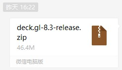
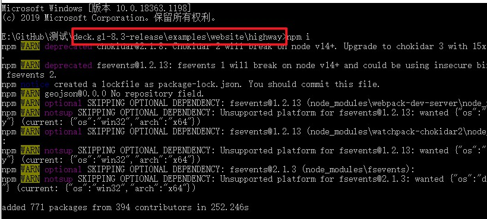
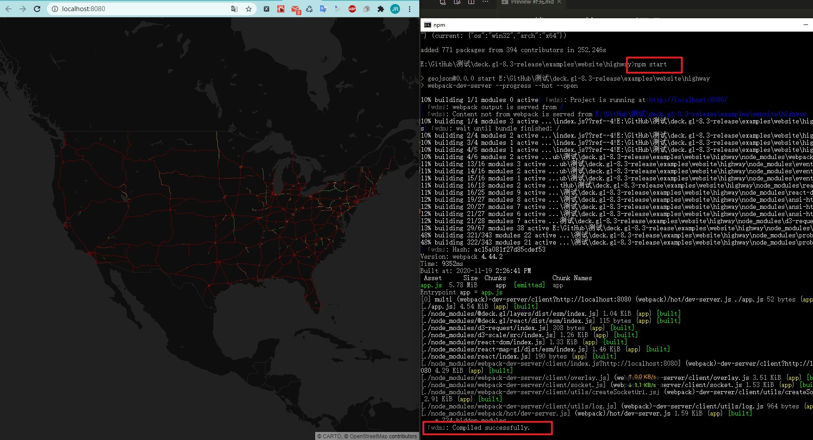
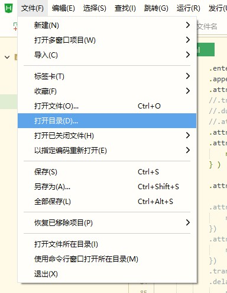
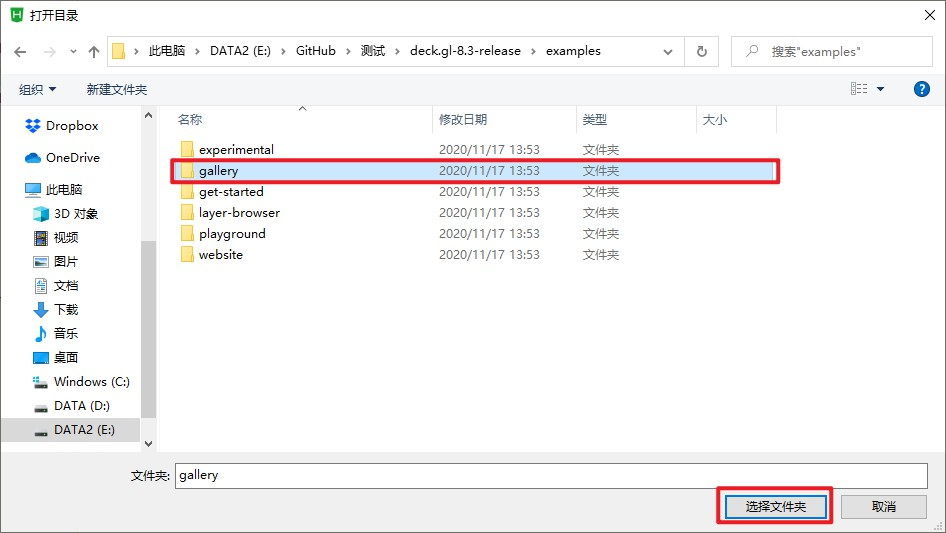
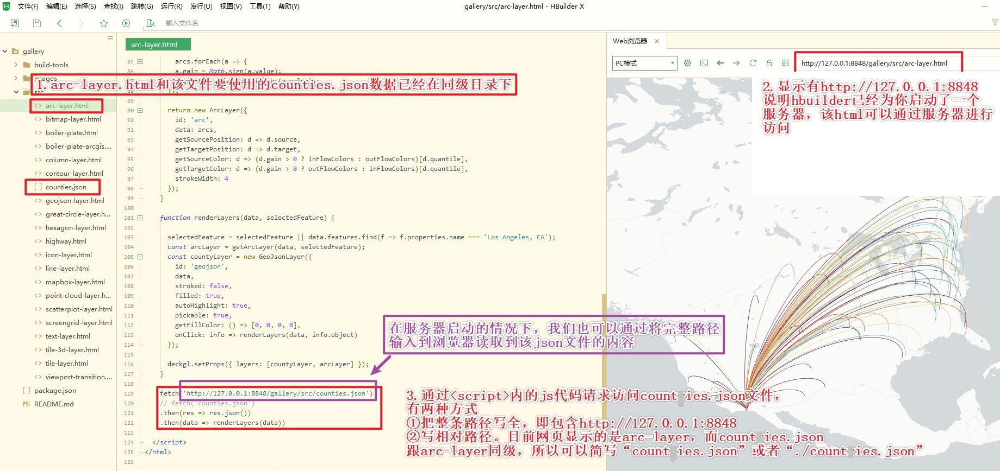
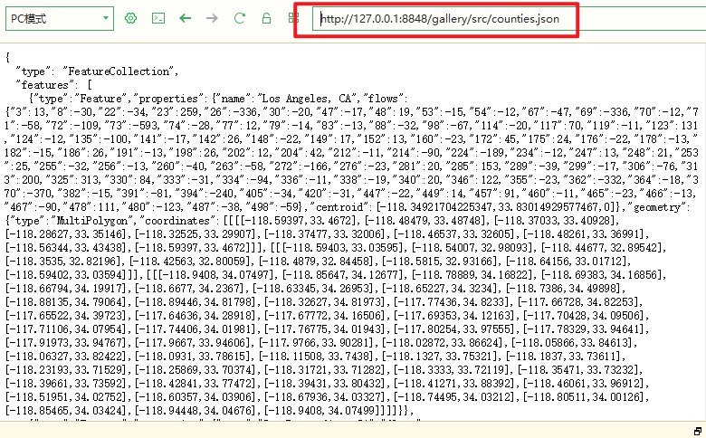
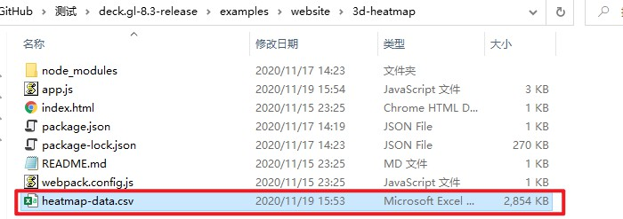
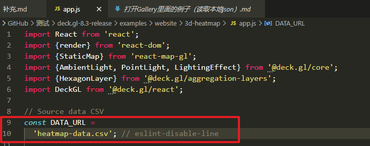
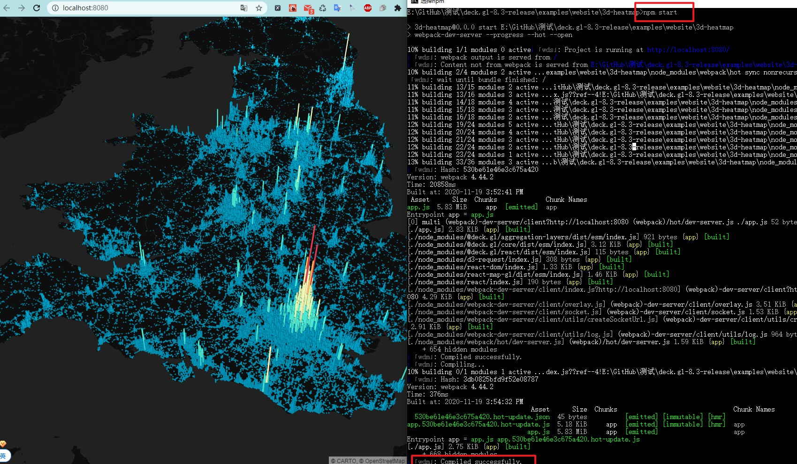

# 下载deck.gl的GitHub源码
## 方法一（速度慢）
+ 通过`git clone https://github.com/visgl/deck.gl.git`下载
## 方法二
+ 将可视化沙龙群里的压缩文件另存到自己想要的位置

---
# npm安装依赖包及启动示例
## npm换淘宝镜像源
+ 执行`npm install`时默认到官网下载依赖包，下载速度会很慢甚至失败报错，需要换成淘宝镜像源，加快下载速度
+ 在命令行窗口执行`npm config set registry https://registry.npm.taobao.org`则设置成了淘宝镜像源（建议）；若想换回官方的源，执行`npm config set registry https://registry.npm.taobao.org`。
+ 换成淘宝源之后，以后的`npm install`应该速度还可以的，如果还不行或报错，可以换个网络试试。还不行再找办法……
## 安装依赖包
+ 例如进入到`examples\website\`文件夹下的某个文件夹下，会发现里面有`package.json`的文件，在这些目录下执行`npm install`的时候`npm`就会根据`package.json`里面的内容进行依赖包的下载。
+ 例如来到`deck.gl-8.3-release\examples\website\highway`文件夹下，打开命令行窗口`cmd`，输入`npm install`（或`npm i`,`i`是`install`的简写）

+ `npm install`成功后（无ERR），输入`npm start`即可启动程序。

---
# 将json文件放到服务器上用于网页读取
由于国内访问deck.gl例子使用的数据时很有可能失败，所以可以将例子中使用的数据保存到服务器上进行启动。当然这些文件也需要有梯子（或者足够好的运气）才能访问并下载，所以有需要的可以请有梯子的朋友帮忙下载一下数据。
## 方法一
+ [打开Gallery里面的例子（读取本地json）](./打开Gallery里面的例子（读取本地json）.md)
## 方法二（针对无需npm start启动的网页文件）
+ 例如`examples\gallery\src`下的全是`html`文件，利用hbuilder打开`gallery`目录

+ 将需要的数据文件放到与`html`文件同级的目录下（这里用到的数据是`counties.josn`和`arc-layer.html`文件），然后修改代码中请求数据的代码，即修改`fetch`的文件路径

+ 通过浏览器访问本地数据

## 方法三（针对需要npm start启动的网页文件）
+ 例如`examples\website`下的所有文件夹都是需要`npm install`和`npm start`才能启动的
+ 例如进入`examples\website\3d-heatmap`文件夹，将需要的文件（该文件也已上传至GitHub中，[heatmap-data.csv](../heatmap-data.csv)）也放在该目录下

+ 使用文本编辑器打开`app.js`，将第10行改成数据文件名

+ 启动`cmd`，执行`npm install`和`npm start`，稍等片刻，就会有浏览器弹出并显示。

## 方法四
+ 即将要学的`flask`或`tornado`开启服务器