# 购买服务器（以阿里云为例）

1. https://cn.aliyun.com/，上阿里云官网，用自己的支付宝扫码登录，支付宝记得进行学生认证，不然买服务器的费用你可能承担不起。

2. 登录成功后，从`产品`中选择`弹性计算`里面的`轻量应用服务器`

   

3. 点击`立即购买`

   

4. 鉴于绝大多数朋友还是对Windows系统熟悉，所以我们选择`Windows2012 R2`系统镜像，当然也可以安装linux系统镜像（但不熟linux的话，入门还是用Windows吧，因为用Windows没那么多新知识,跟用自己的电脑差不多）。此次操作价格没有显示学生价，估计是已经买过了所以第二台不享受学生价。余zy同学刚买不久，购买过程中遇到什么问题可以咨询他。

   

# 配置服务器

1. 购买成功后不知道会不会自动进入`控制台`（若没有自动跳转，可以在https://cn.aliyun.com/，点击右上键的`控制台`进入）

   

2. 按如下图显示的顺序，进入到轻量应用服务器的列表，点击进入到自己的服务器，点击`远程连接`，对自己的服务器进行密码设置（1、2两个密码是不一样的，之后用Windows自带的远程桌面工具连接时使用的是第2点的密码），点击`远程连接`，输入密码即可连接到服务器。

   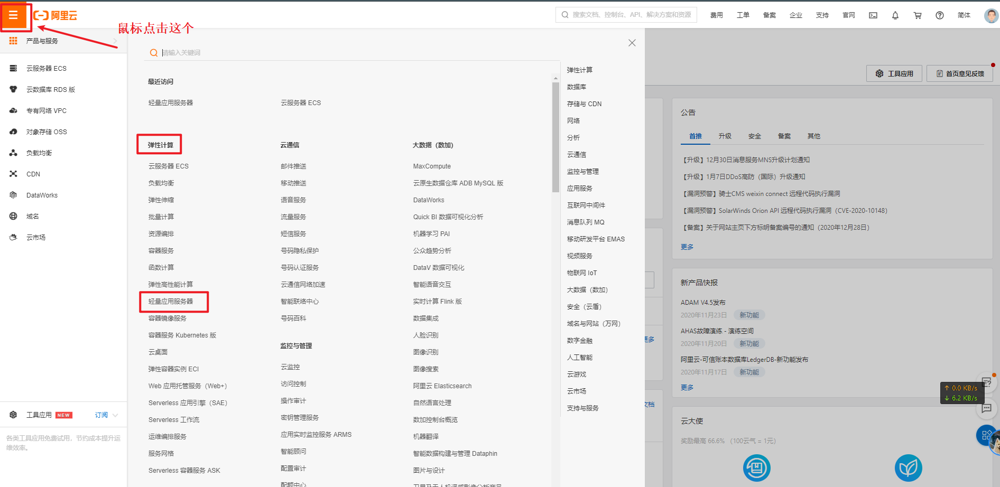

   

   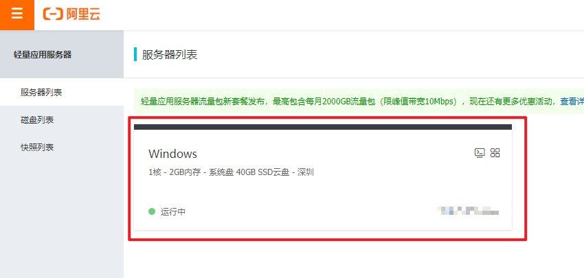

   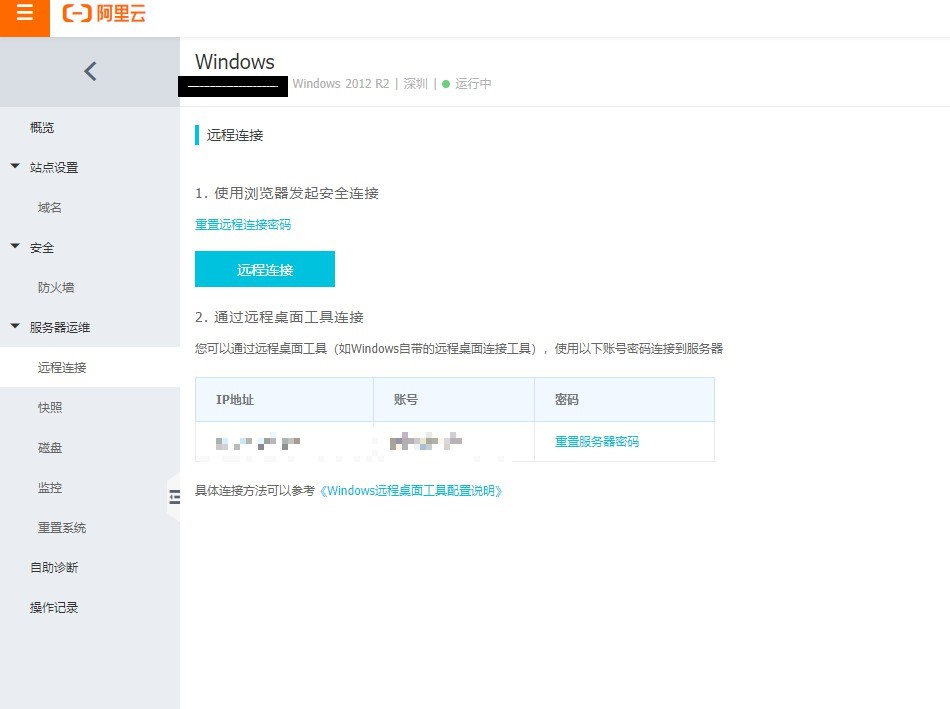

3. 点击`安全`下面的`防火墙`，该处显示的是服务器可以访问的端口，所以当需要在其他端口布置服务时（例如8888端口），则需要通过`添加规则`来添加可供访问的端口

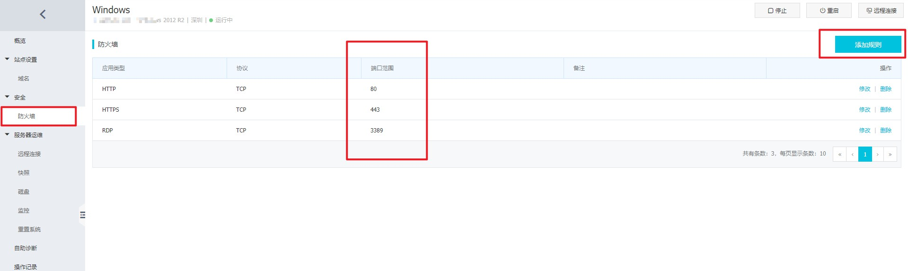

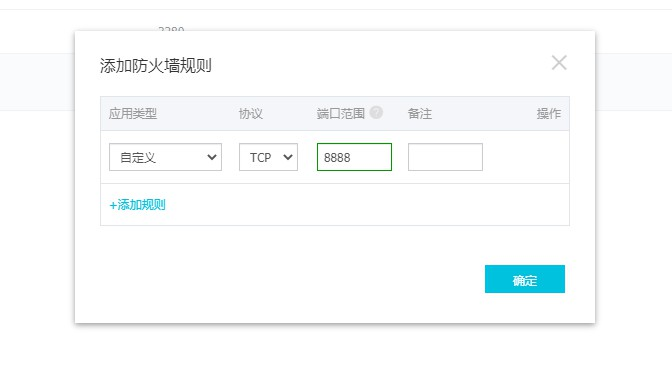

# 利用`远程桌面连接`工具进行连接

1. 上述提到的连接时通过浏览器实现的，但操作麻烦，可以通过Windows自带的`远程桌面连接`进行远程连接操作

   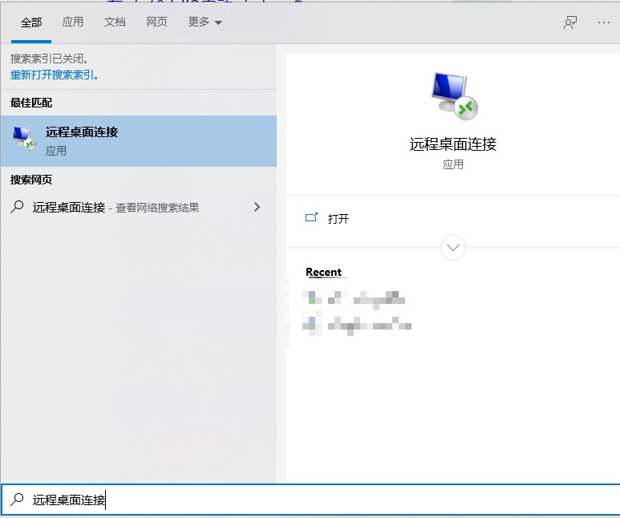

   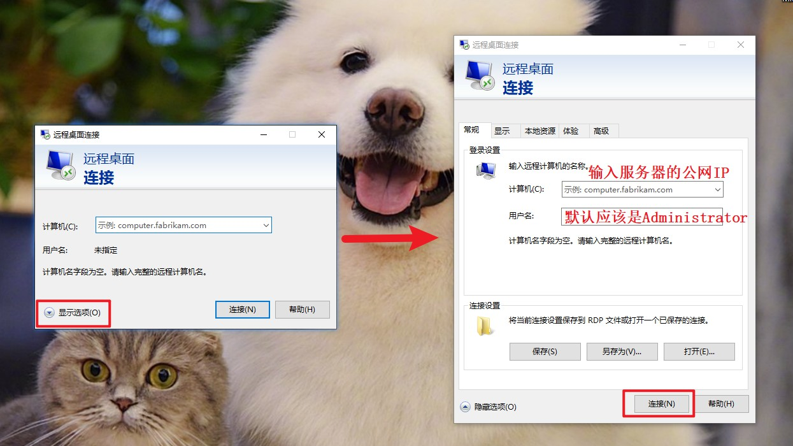

   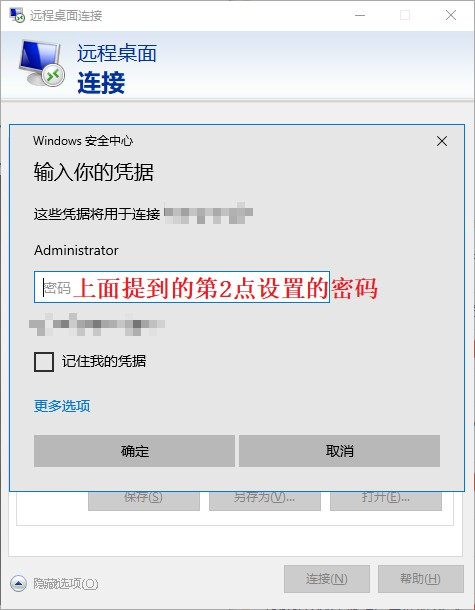

   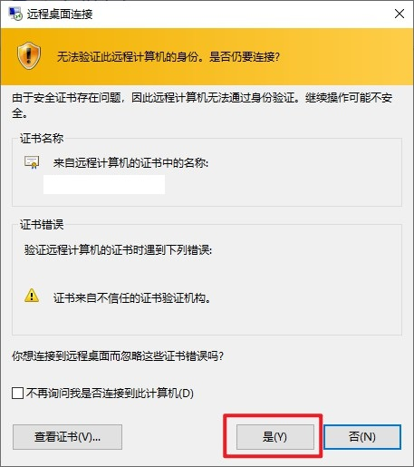

2. 若出现如下错误，按该链接的方法修改注册表https://blog.csdn.net/wudinaniya/article/details/80978436,然后再进行上一步的操作

   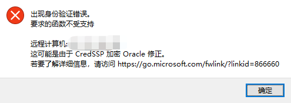

3. 连接成功后可以通过复制本地电脑的文件，粘贴到远程服务器上进行文件传输

# 启动服务

1. 因为我们安装的是Windows的系统镜像，所以开启服务跟我们之前课上讲的是基本一致的，只要使用到的相关端口开启了，就能通过网络进行访问

2. 可以根据夏老师在webgis课上讲的IIS进行服务器开启，也可以安装hbuilder、vscode、python等进行服务器的开启，当然也可以安装Tomcat、Nginx等服务器应用程序。这里就以vscode为例进行演示（本地计算机有安装包的可以直接拖到服务器，这样就省了到浏览器搜索再下载的步骤了，并且传输速度也是挺快的）。

   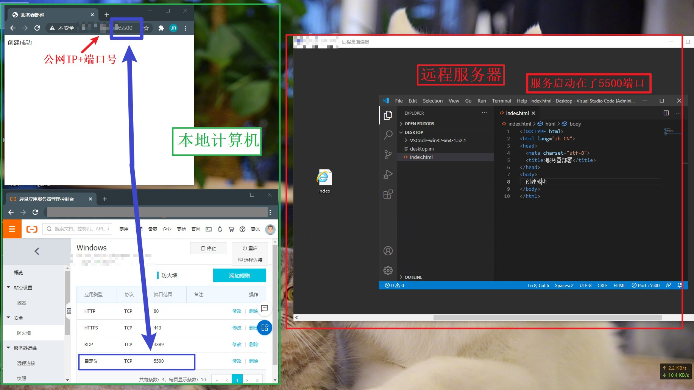

3. 上课的时候怎么开服务的，你就怎么在服务器上开，因为都是Windows系统，操作基本没太大区别，但不建议安装vscode、hbuilder等软件进行开启（服务器内存有限，启动软件消耗太多资源会卡顿），推荐Windows的IIS、Tomcat或者python的flask或tornado库等，记得使用的端口记得打开，不用的端口及时去掉。

