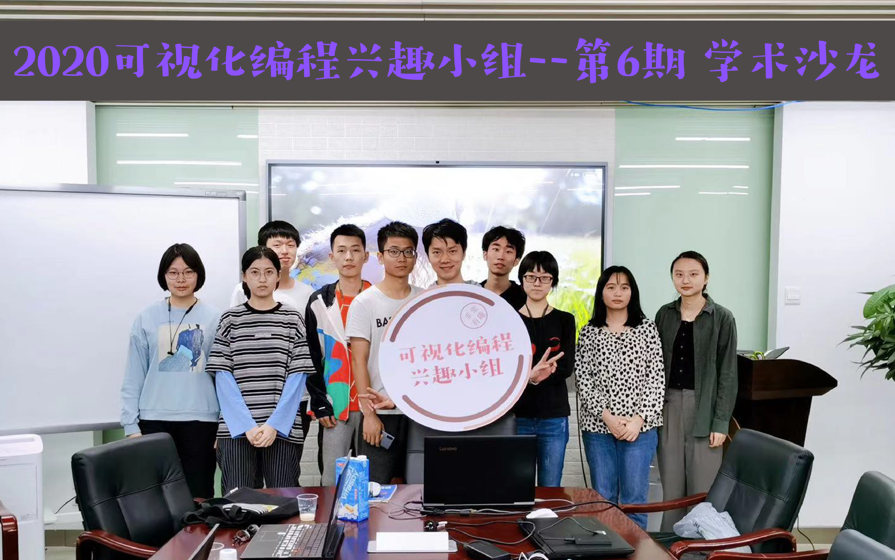
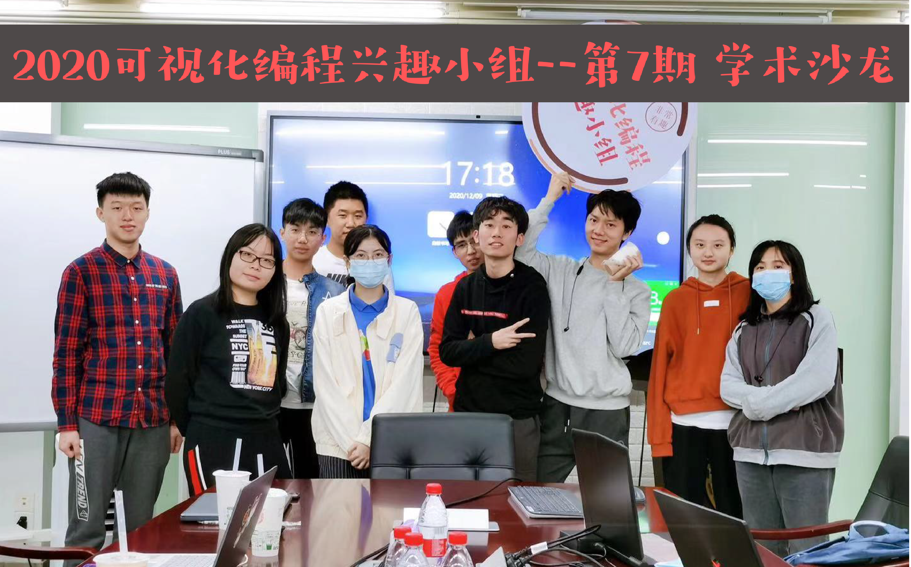
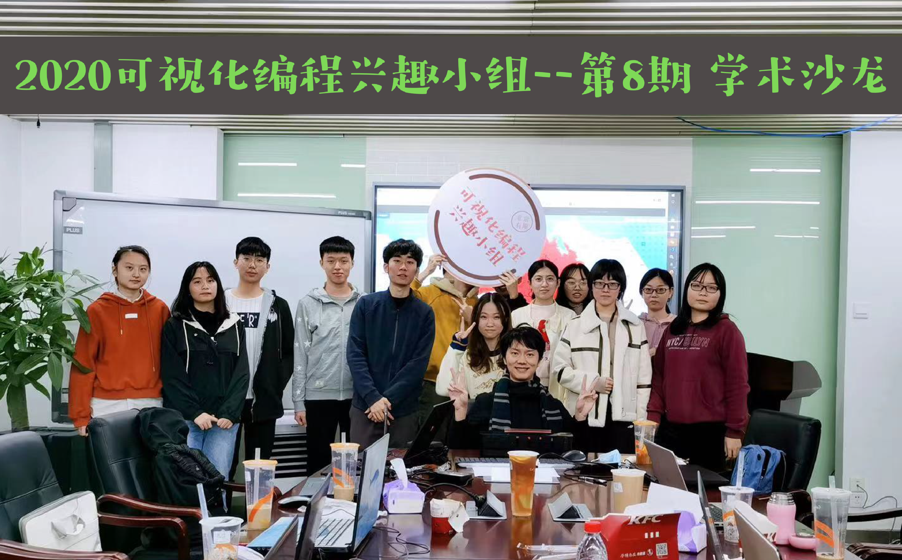

# 第一期 WEB编程基础

# 第二期 可视化及交互编程基础

# 第三期：可视化库d3.js实践（廖金禧，张涓，王乐涵）

# 第四期 可视化库echart，plotly.js实践（方碧宸，王子柔）

# 第五期 空间可视化库amap，deck.gl实践（邓雨婷，熊芮）

# 第六期 （进阶）前端框架react学习与实践 （杨嘉浩 郑澳 张中元）

# 第七期 后端服务器tornado，flask学习与实践 （李美仪，钟国熙，祝老板）

# 第八期 后端数据库连接与使用（林玮妍，佘佳霓，黄键熙，余钊扬）

